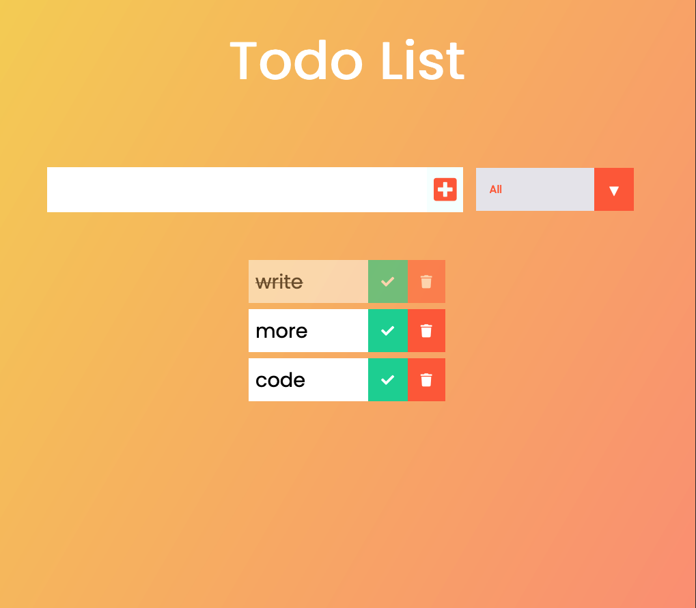

# Todo-List-App
A simple to-do app built using JavaScript, HTML, and CSS. This app allows users to add, delete, and filter their to-do items.The application is a result of a tutorial by Developedbyed.

## Getting Started
To get started, simply clone or download the repository, open the index.html file in your preferred browser, and start adding your to-do items!

## Functionality
Adding to-do items: Enter the item in the input field and click the "Add Todo" button.
Deleting to-do items: Click the trash icon next to the to-do item to delete it.
Filtering to-do items: Use the filter dropdown to show either all items, completed items, or uncompleted items.
Storing to-dos: The app uses local storage to save the to-do items, so your list will persist even if you close the browser.

## Screenshot

## Deployment
The app is deployed on GitHub Pages and can be accessed at https://aloosli.github.io/todo-list-app/
## Resources
The app uses Font Awesome icons for the delete and check buttons.
